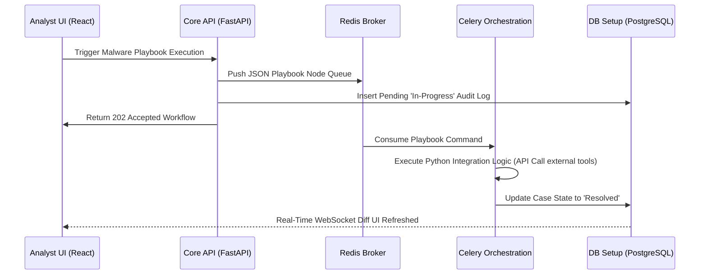

# 🏗️ ASUSOAR Architecture Specification

The ASUSOAR platform embraces modern, containerized **Microservices**. We utilized state-of-the-art tools optimized for speed, security, and parallel task execution. This document explains the exact engine under the hood.

> **GitHub Respository**: [https://github.com/Masriyan/Asu-SOAR](https://github.com/Masriyan/Asu-SOAR)

---

## The Technology Stack

### 1. **Data Layer**
- **PostgreSQL**: Serving as the immutable ledger for our Incidents, Case History, Users, Tenant Settings, and Playbook workflows. It strictly handles relational, transactional consistency.
- **Redis (Key-Value Engine)**: Crucial for three discrete systems:
  1. Managing high-speed JSON caching of Threat Intelligence Feeds (eliminating unnecessary DB calls).
  2. Operating as our WebSocket pub/sub backbone to transmit real-time `ChatOps` messages within the War Room.
  3. Functioning as the primary message broker for our task queues.

### 2. **Backend & Orchestration (Python + FastAPI)**
- **FastAPI / Uvicorn**: The `backend` core is completely asynchronous (`async`/`await`). By choosing FastAPI, we can process upwards of tens-of-thousands of incoming SIEM webhooks (e.g., from Splunk) every minute without blocking. It exposes the entire `/api/v1` REST interface documented via Swagger UI.
- **Celery Worker**: This daemon listens to the Redis broker natively. Its sole purpose is parsing Playbook DAGs (Directed Acyclic Graphs). When a playbook executes an integration (e.g., querying VirusTotal), this node inherently absorbs the runtime block ensuring the main UI API never lags.
- **SQLAlchemy (ORM)**: Clean, typed python abstraction querying out to Postgres schemas.

### 3. **Frontend (React + Next.js)**
- **Next.js 14 Framework**: A high-performance, SEO-friendly, scalable interface engine. We run this containerized as a standalone Node server proxying client requests.
- **Visual Node System (React-Flow)**: The magic behind the drag-and-drop Playbook Editor interface.
- **Styling Pipeline (TailwindCSS)**: Strict utility-classes mapped against a custom CSS theme (`soc-dark`) and fluid glassmorphic interactive animations built atop `framer-motion`. 
- **Axios Networking Layer**: Standardized HTTP bindings enforcing JSON payloads and global 401 Unauthorized handling logic to secure user sessions seamlessly.

## Network Topology / Flow



---

## Deployment Container Configurations

Because the infrastructure relies on an interplay between 5 total systems, our universal `docker-compose.yml` guarantees network namespace linking.

```yaml
# Simplified Namespace Linkages
services:
    db: -> TCP:5432
    redis: -> TCP:6379 
    backend: -> Python API [Depends on db, redis] (TCP:8000)
    worker: -> Celery Command [Depends on backend, db, redis]
    frontend: -> NextJS SSR [Depends on backend] (TCP:3000)
```

By bridging these systems on a unified internal routing subnet, we guarantee the internal communication stays air-gapped from external threats, only exporting explicit ports `3000` and `8000`.
