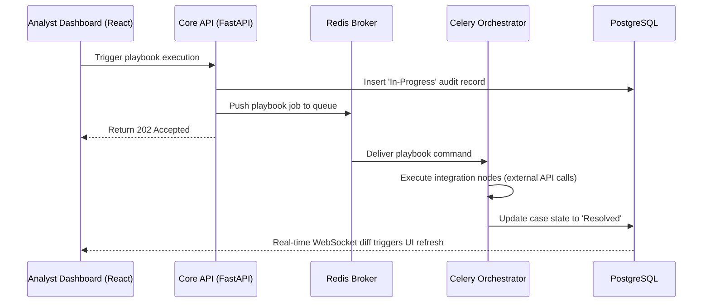

# Architecture

ASUSOAR embraces a containerized **microservices architecture** built for speed, security, and parallel task execution. This document details every component in the stack and how they interconnect at runtime.

> **Repository:** [github.com/Masriyan/Asu-SOAR](https://github.com/Masriyan/Asu-SOAR)

---

## Technology Stack

### Data Layer

**PostgreSQL 15** serves as the platform's immutable ledger. All incidents, case history, user accounts, tenant settings, and playbook workflow definitions are stored here. It is the single source of truth for all relational, transactional data.

**Redis 7** handles three distinct functions within ASUSOAR:

1. **TI Feed Cache** — High-speed JSON caching of Threat Intelligence feeds eliminates redundant database queries for frequently accessed IOC data.
2. **WebSocket Pub/Sub** — Acts as the real-time backbone that broadcasts `ChatOps` messages and case state changes into live War Room sessions.
3. **Task Broker** — Queues playbook execution jobs for consumption by Celery workers.

### Backend & Orchestration (Python / FastAPI)

**FastAPI + Uvicorn** — The backend core is fully asynchronous (`async`/`await` throughout). This allows the engine to process tens of thousands of incoming SIEM webhooks per minute — from tools like Splunk or Elastic — without ever blocking the UI API. The full REST interface is auto-documented via Swagger UI at `/api/v1/docs`.

**Celery Worker** — A long-running daemon that listens to the Redis broker. Its sole purpose is parsing and executing Playbook DAGs (Directed Acyclic Graphs). When a playbook node triggers an integration call (e.g., querying VirusTotal or pushing an IOC to CrowdStrike), the Celery worker absorbs the runtime block entirely, keeping the main API responsive at all times.

**SQLAlchemy ORM** — Provides clean, typed Python abstractions over the PostgreSQL schema, ensuring data integrity and simplifying migrations.

### Frontend (React / Next.js)

**Next.js 14** — A high-performance, server-rendered React framework delivering fast page loads and a scalable component architecture.

**React Flow** — Powers the drag-and-drop Visual Playbook Editor canvas, enabling analysts to construct complex automation graphs without writing code.

**TailwindCSS** — Utility-class styling mapped to a custom `soc-dark` theme with glassmorphic interactive elements animated via `framer-motion`.

**Axios** — Provides standardised HTTP bindings with automatic JSON serialization and global `401 Unauthorized` handling to enforce session security.

---

## Request Flow

The sequence below traces the lifecycle of a playbook execution from trigger to resolution.



---

## Container Architecture

Five Docker services are wired together on a shared internal network. Only ports `3000` and `8000` are exposed externally — all inter-service communication is air-gapped from the outside.

```yaml
# Simplified service dependency map
services:
  db:         PostgreSQL 15     → TCP 5432 (internal only)
  redis:      Redis 7           → TCP 6379 (internal only)
  backend:    FastAPI + Uvicorn → TCP 8000 (exposed) · depends on: db, redis
  worker:     Celery Daemon     → (no exposed port)  · depends on: backend, db, redis
  frontend:   Next.js SSR       → TCP 3000 (exposed) · depends on: backend
```

The full `docker-compose.yml` at the project root defines all service configurations, environment variable bindings, volume mounts, and the `asusoar-net` bridge network.

---

## Network Security Model

All containers share the `asusoar-net` bridge network, which isolates inter-service traffic from the host and external networks. The only ingress points are:

| Port | Service | Protocol |
|------|---------|----------|
| `3000` | Next.js Frontend | HTTP/HTTPS |
| `8000` | FastAPI Backend | HTTP/HTTPS |

Database and Redis ports are bound to the internal Docker network only — they are never accessible from outside the container network.

For production deployments, place a reverse proxy (nginx or Caddy) in front of ports `3000` and `8000` to handle TLS termination and enforce HTTPS.

---

## Directory Structure

```
Asu-SOAR/
├── backend/
│   ├── app/
│   │   ├── api/
│   │   │   ├── endpoints/      # Route handlers (health, incidents, playbooks, etc.)
│   │   │   └── router.py       # API router aggregator
│   │   ├── core/
│   │   │   ├── config.py       # Pydantic settings (env-driven)
│   │   │   └── celery_app.py   # Celery application factory
│   │   ├── db/
│   │   │   ├── session.py      # SQLAlchemy engine and session factory
│   │   │   └── base.py         # Declarative base for ORM models
│   │   ├── models/             # SQLAlchemy ORM model definitions
│   │   └── main.py             # FastAPI app factory and middleware setup
│   ├── requirements.txt
│   └── Dockerfile
├── frontend/
│   ├── src/
│   │   ├── app/                # Next.js App Router pages and layouts
│   │   ├── components/         # Reusable React components
│   │   └── lib/
│   │       └── api.ts          # Axios API client instance
│   ├── public/
│   │   └── banner.svg          # Project banner image
│   ├── package.json
│   └── Dockerfile
├── docker-compose.yml
├── install.sh
├── .env.example
├── README.md
├── ARCHITECTURE.md             # This document
├── FEATURES.md
├── INSTALL.md
└── CONTRIBUTING.md
```
