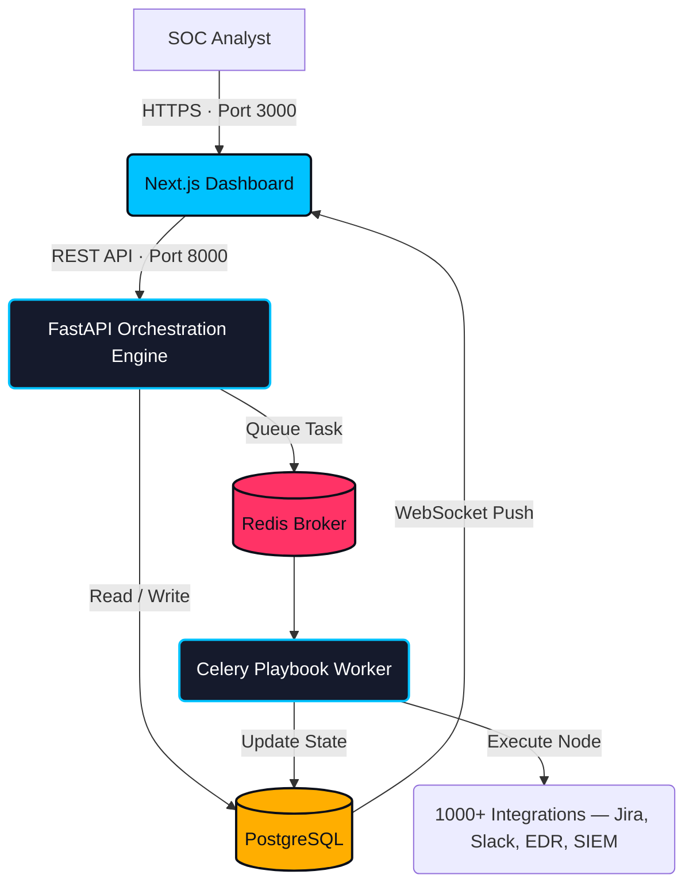

<div align="center">


<br/>

[](https://github.com/Masriyan/Asu-SOAR/actions)
[](https://python.org)
[](https://nextjs.org)
[](https://fastapi.tiangolo.com)
[](https://docker.com)
[](LICENSE)

**[📖 Wiki](https://github.com/Masriyan/Asu-SOAR/wiki) · [🚀 Install Guide](INSTALL.md) · [✨ Features](FEATURES.md) · [🏗️ Architecture](ARCHITECTURE.md) · [🐛 Report Bug](https://github.com/Masriyan/Asu-SOAR/issues)**

</div>

---

## What is ASUSOAR?

**ASUSOAR** is an enterprise-grade Security Orchestration, Automation, and Response (SOAR) platform that unifies your security tools into a single operational interface. Built from the ground up to coordinate actions across **1,000+ third-party integrations**, it eliminates the manual toil that burns out SOC analysts — so your team can focus on what actually matters.

It is engineered around three core pillars:

- **Orchestrate** — A dynamic Python orchestration layer connects your entire security stack under one roof.
- **Automate** — A visual, drag-and-drop Playbook Editor drives up to 95% of repetitive response tasks out of human hands.
- **Respond** — Real-time Collaborative Case Management transforms incident response into a coordinated team effort.

ASUSOAR runs on **any Linux distribution** using Docker containerization, with zero host-level dependency installation required.

---

## Architecture Overview

The following diagram illustrates how the core components interact from an incoming alert to a resolved incident.



> For a deep-dive into every component, see [ARCHITECTURE.md](ARCHITECTURE.md).

---

## Core Capabilities

| Capability | Description |
|---|---|
| **Visual Playbook Editor** | Drag-and-drop DAG builder for constructing complex automated response workflows |
| **Integration Marketplace** | 1,000+ connectors — Splunk, CrowdStrike, Jira, ServiceNow, Palo Alto, and more |
| **ASUBot (ML Co-Pilot)** | AI-powered analyst assignment, severity prediction, and incident categorization |
| **Threat Intel Management** | Multi-feed aggregation from OTX, MISP, Unit 42, and Shodan with confidence scoring |
| **Multi-Tenant / MSSP** | Complete data isolation per client with dedicated dashboards and MTTD/MTTR reporting |
| **War Room ChatOps** | Real-time collaborative investigation with WebSocket-powered evidence timelines |

---

## Quick Start

Ensure **Docker** (v24+) and **Docker Compose** are installed on your Linux host.

```bash
# 1. Clone the repository
git clone https://github.com/Masriyan/Asu-SOAR.git
cd Asu-SOAR

# 2. Configure your environment
cp .env.example .env
nano .env   # Set POSTGRES_PASSWORD and SECRET_KEY

# 3. Launch the full stack
sudo ./install.sh
```

Once complete, the platform will be accessible at:

| Service | URL |
|---|---|
| **Web Dashboard** | `http://localhost:3000` |
| **API + Swagger Docs** | `http://localhost:8000/docs` |

For full prerequisites, system requirements, and production deployment guidance, see **[INSTALL.md](INSTALL.md)**.

---

## Technology Stack

ASUSOAR is built on a modern, battle-tested stack chosen for performance, async scalability, and developer ergonomics.

| Layer | Technology | Role |
|---|---|---|
| **Frontend** | Next.js 14, React, TailwindCSS | SOC dashboard and Playbook Editor UI |
| **API** | FastAPI, Uvicorn | Async REST engine and webhook ingestion |
| **Task Queue** | Celery, Redis | Asynchronous playbook DAG execution |
| **Database** | PostgreSQL 15 | Persistent incident and case storage |
| **Cache / Pub-Sub** | Redis 7 | TI feed caching and WebSocket relay |
| **Containerization** | Docker, Docker Compose | Single-command full-stack deployment |

---

## Contributing

Contributions — from new integrations to documentation improvements — are what make ASUSOAR better for the entire security community.

See **[CONTRIBUTING.md](CONTRIBUTING.md)** for our full guide, coding standards, and workflow.

```bash
# Quick contribution workflow
git checkout -b feature/your-integration-name
git commit -m 'feat: add CrowdStrike IOC upload node'
git push origin feature/your-integration-name
# Then open a Pull Request on GitHub
```

---

## License

Distributed under the **MIT License**. See `LICENSE` for details.

---

<div align="center">
  <sub>Built for the security community · <a href="https://github.com/Masriyan/Asu-SOAR">github.com/Masriyan/Asu-SOAR</a></sub>
</div>
