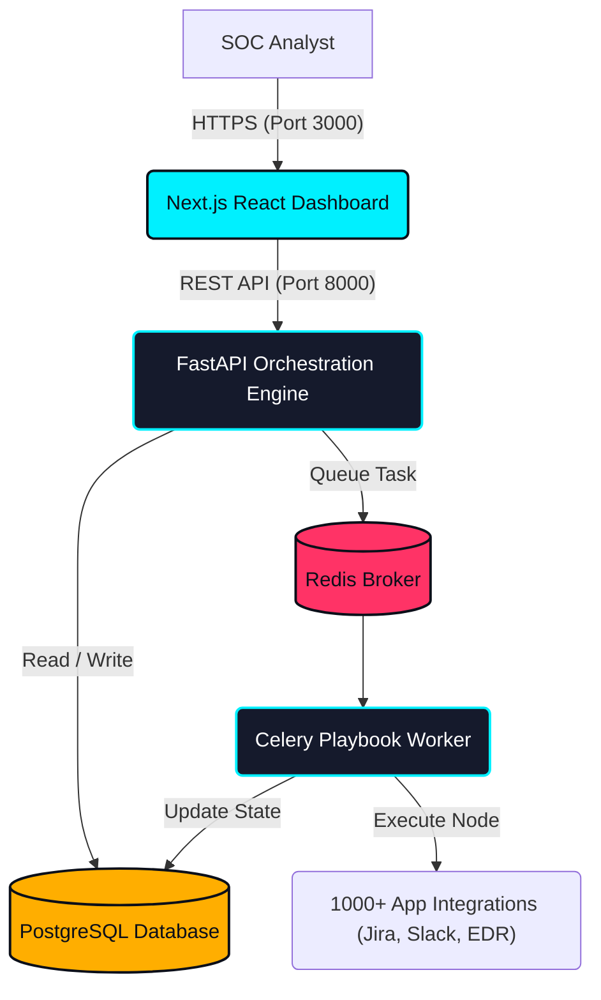

<div align="center">
  

## Security Orchestration, Automation, and Response Platform

**[Documentation](https://github.com/Masriyan/Asu-SOAR/wiki) • [Installation](INSTALL.md) • [Report Bug](https://github.com/Masriyan/Asu-SOAR/issues)**

[]()
[]()
[]()
[]()
</div>

---

## 🛡️ What is ASUSOAR?

**ASUSOAR** is an enterprise-grade Security Orchestration, Automation, and Response (SOAR) platform designed to unify disparate security tools into a single pane of glass. It is engineered from scratch to coordinate actions across 1000+ third-party products, leverage the "Automation-First" paradigm using graphical playbooks, and empower SOC analysts through real-time Collaborative Case Management.

Built defensively, ASUSOAR operates within a sophisticated, multi-tenant Microservices Architecture designed to run on **any* Linux distribution utilizing Docker containerization.

## ✨ Core Capabilities

- **Security Orchestration**: Consolidate integrations under a dynamic Python orchestration layer.
- **Automation-First Response**: Drive up to 95% of tedious SOC tasks out of human hands via our Visual Playbook Editor workflows.
- **Collaborative Case Management**: Spin up instantaneous "Virtual War Rooms" for live evidence ingestion, tagging, and ChatOps interactions.
- **Threat Intel Management (TIM)**: Seamlessly aggregate, score, correlate, and prioritize feed intelligence.
- **Machine Learning (ASUBot)**: Utilize intelligent modeling to assign analysts, categorize incidents, and compute proactive severity scales.

---

## 🏗️ System Architecture Flow

The following sequence illustrates the underlying structural engine that drives ASUSOAR's capabilities.



---

## ⚡ Key Features Pipeline

- **Visual Playbook Editor**: Construct massive automated directed acyclic graphs (DAGs) using a robust drag-and-drop workspace UI.
- **Customizable Dashboards**: Fully modular metrics grid driven by robust SOC KPIs.
- **Multi-tenant / MSSP Architecture**: Rigid boundary separation allowing managed service providers to orchestrate infinite downstream children clusters from a master node.
- **Playground Sandbox**: Safely dry-run untested Python plugins or commands without corrupting production Postgres states.

## 🚀 Quick Start

Ensure that you have Docker and Docker Compose installed on your host Linux machine.

Detailed instructions are available in [INSTALL.md](INSTALL.md). 

```bash
git clone https://github.com/Masriyan/Asu-SOAR.git
cd Asu-SOAR
sudo ./install.sh
```

## 🤝 Contributing

Contributions are what make the open source community such an amazing place to learn, inspire, and create. Any contributions you make are **greatly appreciated**. Please open an issue or pull request at [https://github.com/Masriyan/Asu-SOAR](https://github.com/Masriyan/Asu-SOAR).
